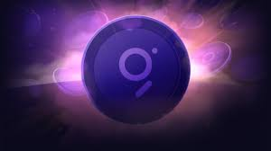

# THE GRAPH

*February 12, 2022 case study by Lauren Krohn*

___
## Table of Contents

  - [What is The Graph?](#what-is-the-graph)
  - [Why Does The Graph Matter for Web3?](#why-does-the-graph-matter-for-web3)
  - [Founders' Story](#founders-story)
  - [Funding and Outlook](#funding-and-outlook)
  - [The Graph's Core Work](#the-graphs-core-work)
  - [How Does The Graph Accomplish its Work?](#how-does-the-graph-accomplish-its-work)

  - [References](#references)
___

## What is The Graph?

[The Graph](https://thegraph.com/en/) started as a vision for an **open-source, decentralized query and indexing protocol** for blockchains. It has become "The Graph Network" - a independent blockchain built on a fully decentralized model to promote cooperation at scale through protocols. But what does any of that *mean*? It may help to define our terms: 

* **[blockchain](https://www.forbes.com/advisor/investing/what-is-blockchain/)** - a revolutionary way to store data publicly, yet securely, so it can be used by all participants in a decentralized system. 

* **[decentralized](https://en.wikipedia.org/wiki/Decentralization) system** - decision-making, administrative, and planning functions are performed at a local level, not concentrated in a central authority. 

* **[protocol](https://www.merriam-webster.com/dictionary/protocol)** - a system of rules. Guidelines. "If/Then" statements.

* **[internet protocol](https://en.wikipedia.org/wiki/Internet_Protocol)** - a set of rules to define how data is shared across computers. The internet as we know it is just a widely followed protocol of computer interactions. 

* **[query language](https://en.wikipedia.org/wiki/Query_language)** - a set of rules that allows you to retrieve data. To most of us, we know Google as a bar that allows us to [use plain language to query all web pages](https://blog.google/products/search/search-language-understanding-bert/) on the internet. All [databases need a query language](https://www.hostinger.com/tutorials/what-is-a-query) to pull information out of the depths.[^1] 

* **[indexing protocol](https://en.wikipedia.org/wiki/Search_engine_indexing)** - a set of rules for how to collect, parse, and store data so it's easy to search and retrieve. Twitter's [hashtags](https://bigthink.com/articles/what-can-we-learn-from-hashtags-as-an-indexing-tool-for-scholarly-research/) are a form of indexing protocol.

* **[open source](https://en.wikipedia.org/wiki/Open_source)** - information that is available to all, both to contribute and to view.  

* **[decentralized internet](https://www.investopedia.com/tech/can-decentralized-blockchainbased-internet-become-reality/)** - an internet model that doesn't have to rely on centralized data to be convenient and effective. This model is based on the blockchain's capability to secure a system of decentralized currency. Blockchains can be used to automate complex administrative processes that, historically, needed to be operated or at least supervised by a live person.

* **["Web3"](https://en.wikipedia.org/wiki/Web3)** - a decentralized internet model rooted in blockchain platforms like [Ethereum](https://ethereum.org/en/), [Solana](https://solana.com/community?gclid=CjwKCAiAo4OQBhBBEiwA5KWu_4ohcizpxi9jHvbojpbd9-FEPvN8XN5ocJAyNT4HW20D0JUA_WRA7hoCrkEQAvD_BwE), [Polkadot](https://polkadot.network/), [Near](https://near.org/), [Cosmos](https://cosmos.network/intro), [Binance](https://www.binance.us/en/home), and [Avalanche](https://www.avax.network/).

___

## Why Does The Graph Matter for Web3?

Jargon aside, the easiest way to think about the Graph is doing is: building Google for blockchains - the decentralized internet, web3. Google [indexed the world wide web](https://www.google.com/search/howsearchworks/crawling-indexing/#:~:text=Finding%20information%20by%20crawling&text=We%20use%20software%20known%20as,webpages%20back%20to%20Google's%20servers.) to create a search engine that can take in natural language and return highly satisfying search results. The Graph is indexing blockchains with the goal of building a highly functional search engine for the decentralized internet. And like Google made the world wide web accesible to all, The Graph wants make blockchain accessible to everyone. In the words of one of its founders: ["If web3 is going to catch on we need to provide experiences that are as good or better than centralized alternatives."](https://medium.com/graphprotocol/introducing-the-graph-4a281b28203e)

**But The Graph isn't Google.**

It isn't Google for the same reason web3 isn't web2. The Graph is decentralized, and Google is centralized. Google employs over 100,000 people. It has always had a noble mission (["to organize the world’s information and make it universally accessible and useful"](http://panmore.com/google-vision-statement-mission-statement)), but it grapples the typical [big corporate problems](https://www.cnbc.com/2020/01/02/google-employee-growth-2001-through-2019.html?__source=sharebar|email&par=sharebar), like [how to amass a cheap workforce](https://www.nytimes.com/2019/05/28/technology/google-temp-workers.html?auth=login-google1tap&login=google1tap), how to [motivate people](https://slate.com/technology/2013/01/google-people-operations-the-secrets-of-the-worlds-most-scientific-human-resources-department.html), how to [fend off attempts to break up its monopoly](https://techcrunch.com/2020/12/17/google-antitrust-lawsuit-new-york-colorado-35-states-search/#:~:text=35%20states%20%7C%20TechCrunch-,Google%20slammed%20for%20'monopoly%20power'%20in%20new,antitrust%20lawsuit%20from%2035%20states&text=On%20Thursday%2C%20a%20group%20of,in%20search%20and%20search%20advertising.)... on and on. It's a corporation.[^2] 

The Graph, on the other hand, is not only using blockchain technology to be *not a corporation* itself, its entire mission is to make it easier for developers to build every component of an application in a decentralized way (["to enable internet applications that are entirely powered by public infrastructure"](https://thegraph.com/blog/the-graph-network-in-depth-part-1)).

So while Google depends on a centralized model to function - centralized servers, decisionmaking centralized in a corporation - The Graph's decentralized model functions by providing incentives to earn its native cryptocurrency, GRT tokens, to a [decentralized workforce](https://thegraph.com/blog/year-one-web3-renaissance).  

___

## Founders' Story

The founders of The Graph are true believers in the decentralized internet. It was founded in 2018 by [Yaniv Tal](https://twitter.com/yanivgraph), [Brandon Ramirez](https://twitter.com/RezBrandon), and [Jannis Pohlman](https://twitter.com/jannispohlmann). As software engineers, they had worked together on a few startups before beginning to build decentralized applications - dApps - in Ethereum in 2017.

Coming from the more mature centralized model, it was quickly apparent that blockchains didn't have a great search function. Web3 might *publish* everything as open-source information but that didn't mean it was readily *accessible*. This was a problem, and not only because it made it difficult to build dApps. They saw people trying to plug the gaps by reverting to a centralized system, jeopardizing the entire decentralized structure of blockchains by making them dependent on centralized systems. If web3 wasn't searchable, how could it ever become widely used? And if web3 only became searchable through a centralized model, how could it maintain its core, revolutionary integrity?

"[The idea of making open data more accessible became an obsession of ours and The Graph was born.](https://medium.com/graphprotocol/introducing-the-graph-4a281b28203e)"

___
## Funding and Outlook

Yaniv Tal, the current CEO of The Graph, [first publicized](https://medium.com/graphprotocol/introducing-the-graph-4a281b28203e) its existence on June 5, 2018, on Twitter. It raised several million dollars throughout 2019, and then made an Initial Coin Offering on the Ethereum network on October 28, 2020, [securing $12 million in funding](https://www.crunchbase.com/organization/the-graph/investor_financials) through the sale of its GRT token.[^3] The Graph has since [migrated](https://thegraph.com/blog/mainnet-migration) from using a token hosted on the Ethereum network to ["mainnet"](https://thegraph.com/blog/mainnet-migration) - its own separate blockchain.

The Graph used its holdings recently to fund its growth. On January 21, 2022, it announced that it raised $50 million through a ["strategic GRT sale from its treasury,"](https://thegraph.com/blog/graph-raise) and that the money will be used "to aggressively onboard the brightest minds in web3."

This funding decision comes at a time when blockchains are proliferating, and The Graph's first real competitor, [SubQuery](https://subquery.network/), is [gaining momentum](https://techstartups.com/2021/11/22/indexing-protocols-blockchain-subquery-vs-graph/) on the new blockchain platform [Polkadot](https://www.forbes.com/sites/kenrapoza/2021/02/21/ethereum-killer-polkadot-whats-so-great-about-it-and-why-buy-it/?sh=24dc36376fce). The web3 community recognizes the need for universal query languages and indexing protocols to compete with a centralized model, but the community really just wants the tool that works the best. It seems The Graph may be scaling up to be more competitive in the race to index the most blockchains. The Graph grew up in Ethereum, but right now it supports indexing data from [26 different blockchain networks](https://www.coindesk.com/business/2022/01/21/google-for-blockchains-the-graph-raises-50m-led-by-tiger-global/), including Ethereum, Near, Arbitrium, Optimism, Polygon, Avalanche, Celo, Fantom, Moonbeam and IPFS. 

A new system like web3 tends to attact a bleeding-edge type of person that is voracious about progress and improvements. We're still in the early days of the blockchain revolution, and it remains to be seen what type of "Google" model will win out - [if there even needs to be a winner at all](https://medium.com/dragonfly-research/blockchains-are-cities-564327013f86). 
___

## The Graph's Core Work

The Graph's core work is as an indexer of the blockchain. The essential engineering behind this process is to build an application programming interfaces, or API, that makes it easy for developers to access the data stored on any individual blockchain. These APIs are called [subgraphs](https://thegraph.com/explorer). This indexing work is being thought of as the "[connective tissue](https://www.coindesk.com/business/2022/01/21/google-for-blockchains-the-graph-raises-50m-led-by-tiger-global/#:~:text=connective%20tissue)" of the decentralized internet.

Since its migration to its own blockchain, The Graph must also secure and maintain its blockchain structure.
___

## How Does The Graph Accomplish its Work?

The Graph is driven by a combination of [directly funded development teams, grant-funded contributors, and individual contributors](https://thegraph.com/blog/year-one-web3-renaissance). Its five core development teams that are directly funded through a traditional employment model. It provides grants to over 100 additional contributors through [The Graph Foundation](https://www.notion.so/The-Graph-Foundation-e822e66d7b614fdd899a647f5db51a68). Individual contributors are also incentivized to participate in the network as [Indexers](https://thegraph.com/docs/en/indexing) (node operators that are compensated for indexing and query processing services), [Delegators](https://thegraph.com/docs/en/delegating) (help to secure the network without running a Graph Node themselves), [Curators](https://thegraph.com/docs/en/curating) (assess and signal on the subgraphs that should be indexed), and [Subgraph Developers](https://thegraph.com/docs/en/developer/quick-start).

These processes are facilitated by the incentive to earn GRT,  and are executed through [smart contracts](https://www.investopedia.com/terms/s/smart-contracts.asp).

[^1]: Querying languages are the keys to the internet, because even if information is *available* to all, that doesn't mean it's *usable* by all. Search engines evolved from querying languages that were used in databases - think [boolean operators](https://libguides.mit.edu/c.php?g=175963&p=1158594) and [separate search fields](https://libguides.mit.edu/c.php?g=175963&p=1158752). These database search methods require some precision from the person searching, and in turn deliver precise results. But precision is hard. It takes mental effort. Most people don't want to waste time with it, and even those who feel it isn't a waste of time will spend more energy being precise, and have less energy for reading content.

[^2]: Are corporations inherently bad? I won't make a judgment. They are certainly preferable to older ways of incentivizing large-scale cooperation, like fear of the king or fear of a wrathful god. Corporations are simply one way for people to align their incentives to cooperate on big things, and since the [Dutch United East India Company](https://www.businessinsider.com/rise-and-fall-of-united-east-india-2013-11) really kicked things off, the corporate model has been extraordinarily effective and [responsible for our current era of globalization](https://www.weforum.org/agenda/2019/01/how-globalization-4-0-fits-into-the-history-of-globalization/).

[^3]: The Initial Coin Offering (ICO) is somewhat mystifying to those of us still in the mainstream system, but in mainstream terms, an ICO is like The Graph "going public." Instead of stock, though, it offers a coin or token. The Graph's coin is called GRT. In its ICO, The Graph sold about 400 million GRT tokens for $0.03, payable in Ethereum (ETH), netting $12 million ETH. In October 2020 ETH hovered around $400 per coin, meaning The Graph brought in about 30,000 ETH. But ETH has increased in value a lot since October 2020. As of February 13, 2022, ETH traded at $2,888 (off its almost $5,000 peak in late 2021) - which means that The Graph's initial $12 million in ETH is now worth over $86 million.
Counting the ICO proceeds doesn't take into account the rise in value of GRT itself. In February 2022, GRT is trading around $0.40 - $0.50, a 150% increase from its ICO price of $0.03. That's also down from off its 2021 peak of $2.87 (a 9,300% increase). There are almost 5 billion GRT coins in circulation at the moment, with a max supply of 10 billion GRT coins. The Graph Foundation regulates those coins, but - like a government - it essentially prints that money. At half a doller for one GRT, it could sell off 5 billion GRT tomorrow and raise $2.5 billion (if enough people were interested, and that's pretty much a deal-breaking "if"). If The Graph had sold all remaining GRT at its $2.87 peak, that's $14,350,000,000 (14 billion, 350 million dollars!).

___
### References

https://thegraph.com/en/

https://www.forbes.com/advisor/investing/what-is-blockchain/

https://en.wikipedia.org/wiki/Decentralization

https://www.merriam-webster.com/dictionary/protocol

https://en.wikipedia.org/wiki/Internet_Protocol

https://en.wikipedia.org/wiki/Query_language

https://blog.google/products/search/search-language-understanding-bert/

https://www.hostinger.com/tutorials/what-is-a-query

https://en.wikipedia.org/wiki/Search_engine_indexing

https://bigthink.com/articles/what-can-we-learn-from-hashtags-as-an-indexing-tool-for-scholarly-research/

https://en.wikipedia.org/wiki/Open_source

https://www.investopedia.com/tech/can-decentralized-blockchainbased-internet-become-reality/

https://en.wikipedia.org/wiki/Web3

https://ethereum.org/en/

https://solana.com/community?gclid=CjwKCAiAo4OQBhBBEiwA5KWu_4ohcizpxi9jHvbojpbd9-FEPvN8XN5ocJAyNT4HW20D0JUA_WRA7hoCrkEQAvD_BwE

https://polkadot.network/

https://near.org/

https://cosmos.network/intro

https://www.binance.us/en/home

https://www.avax.network/

https://www.google.com/search/howsearchworks/crawling-indexing

https://medium.com/graphprotocol/introducing-the-graph-4a281b28203e

http://panmore.com/google-vision-statement-mission-statement

https://www.cnbc.com/2020/01/02/google-employee-growth-2001-through-2019.html?__source=sharebar|email&par=sharebar

https://www.nytimes.com/2019/05/28/technology/google-temp-workers.html?auth=login-google1tap&login=google1tap

https://slate.com/technology/2013/01/google-people-operations-the-secrets-of-the-worlds-most-scientific-human-resources-department.html

https://techcrunch.com/2020/12/17/google-antitrust-lawsuit-new-york-colorado-35-states

https://thegraph.com/blog/the-graph-network-in-depth-part-1

https://thegraph.com/blog/year-one-web3-renaissance

https://twitter.com/yanivgraph

https://twitter.com/RezBrandon

https://twitter.com/jannispohlmann

https://www.crunchbase.com/organization/the-graph/investor_financials

https://thegraph.com/blog/mainnet-migration

https://thegraph.com/blog/graph-raise

https://subquery.network/

https://techstartups.com/2021/11/22/indexing-protocols-blockchain-subquery-vs-graph/

https://www.forbes.com/sites/kenrapoza/2021/02/21/ethereum-killer-polkadot-whats-so-great-about-it-and-why-buy-it/?sh=24dc36376fce

https://www.coindesk.com/business/2022/01/21/google-for-blockchains-the-graph-raises-50m-led-by-tiger-global/

https://medium.com/dragonfly-research/blockchains-are-cities-564327013f86

https://thegraph.com/explorer

https://www.coindesk.com/business/2022/01/21/google-for-blockchains-the-graph-raises-50m-led-by-tiger-global

https://thegraph.com/blog/year-one-web3-renaissance

https://www.notion.so/The-Graph-Foundation-e822e66d7b614fdd899a647f5db51a68

https://thegraph.com/docs/en/indexing

https://thegraph.com/docs/en/delegating

https://thegraph.com/docs/en/curating

https://thegraph.com/docs/en/developer/quick-start

https://www.investopedia.com/terms/s/smart-contracts.asp

https://libguides.mit.edu/c.php?g=175963&p=1158594

https://libguides.mit.edu/c.php?g=175963&p=1158752

https://www.businessinsider.com/rise-and-fall-of-united-east-india-2013-11

https://www.weforum.org/agenda/2019/01/how-globalization-4-0-fits-into-the-history-of-globalization/