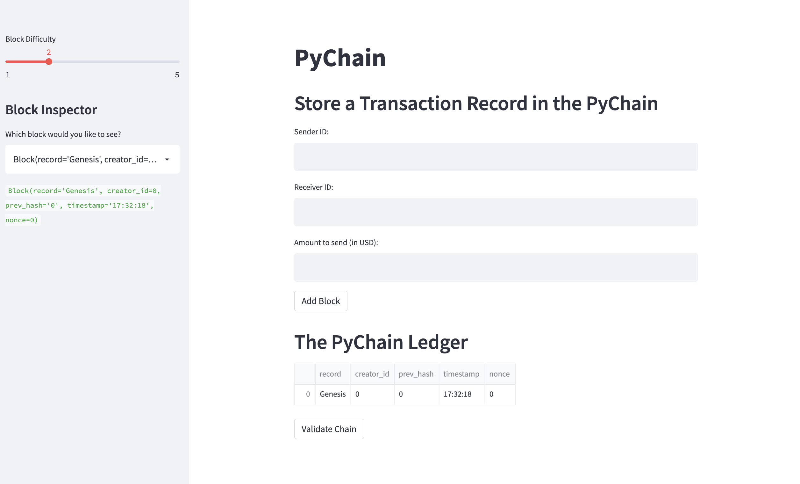
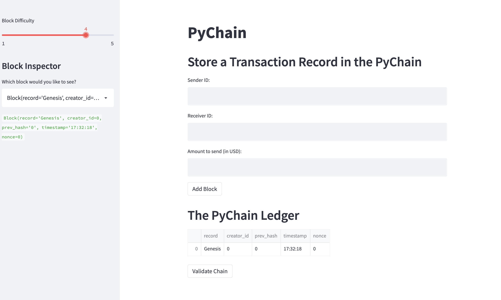
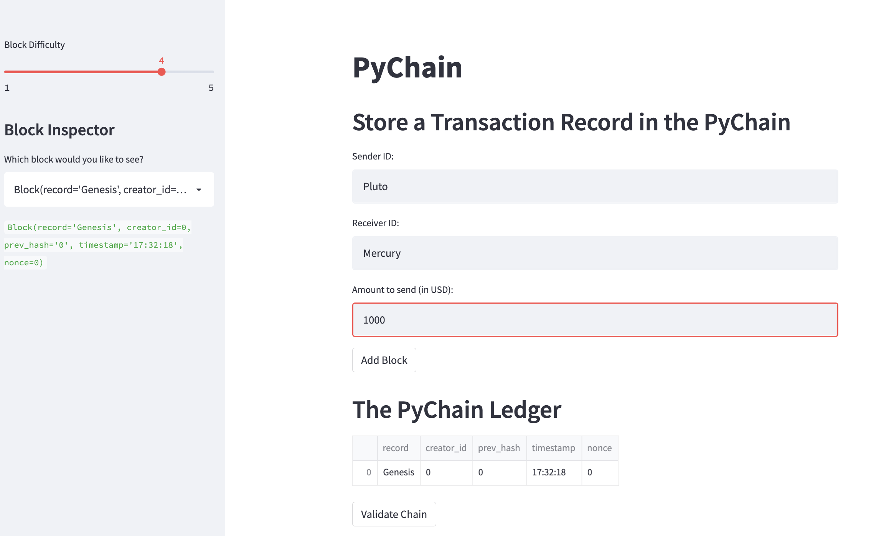
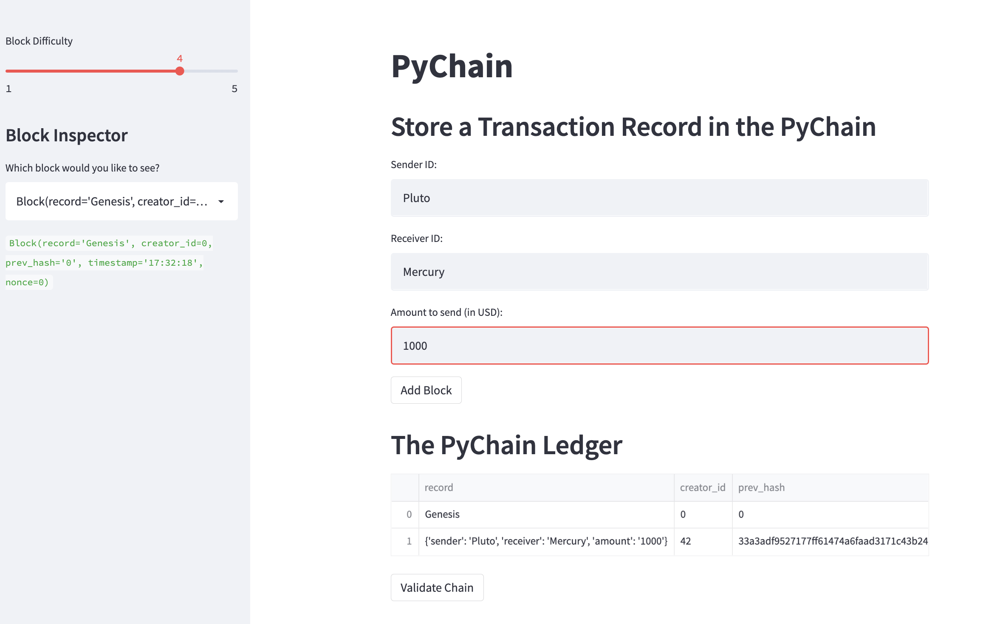
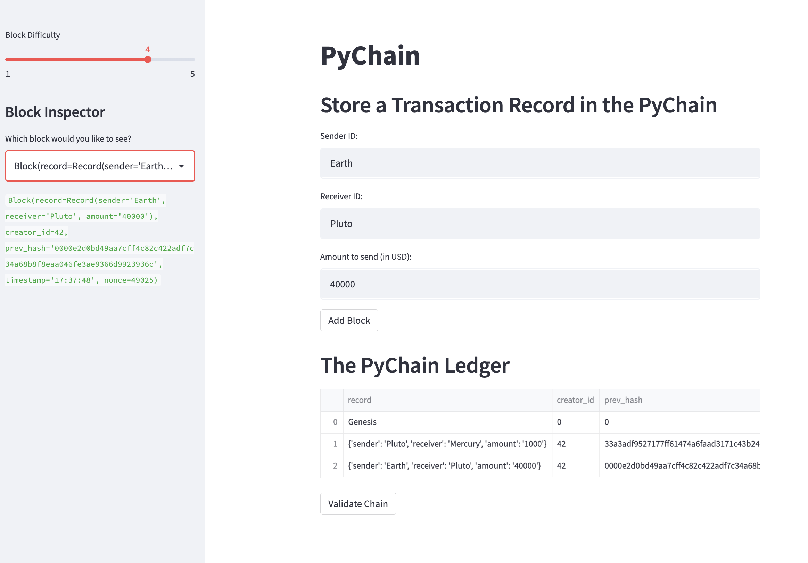
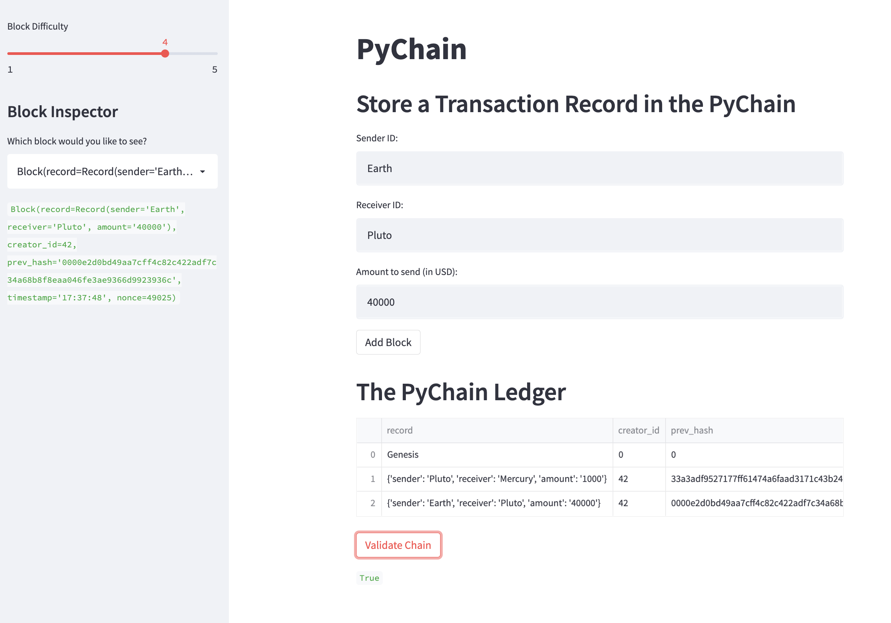
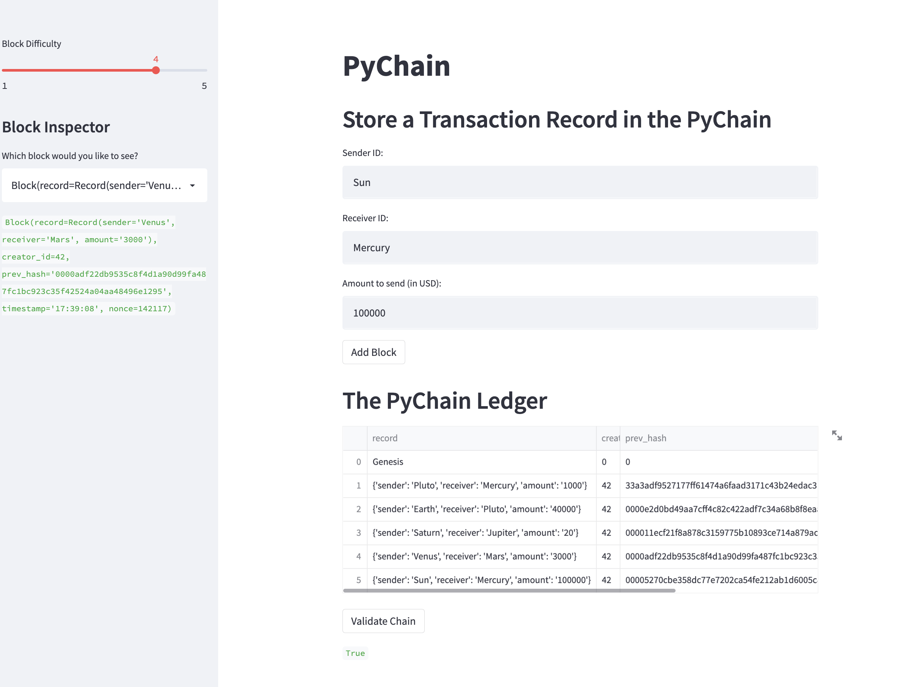
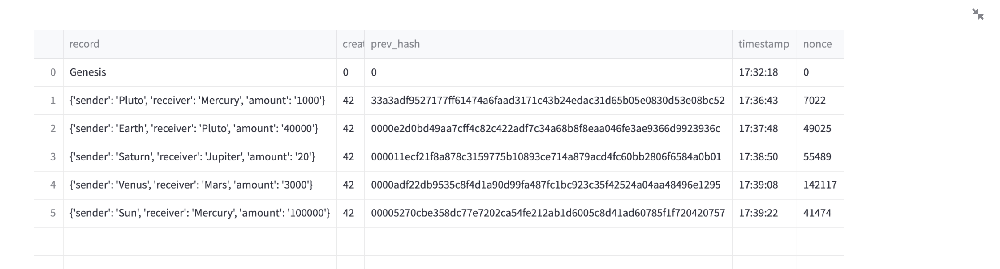

# PyChain Ledger

The PyChain Ledger streamlit application is designed to give our partner banks a platform for user access to our blockchain-based ledger system. The ledger allows for easy recording of transactions and a simple mechanism to verify the transaction through our blockchain technology.

---
## Open the PyChain Ledger Application using Streamlit

In the terminal, navigate to the project folder where the PyChain Ledger Application is saved.

Run the Streamlit application by entering `streamlit run pychain.py` in the terminal.

---
## Genesis Block

The opening page of the streamlit application will show the Genesis Block for the PyChain Ledger:

---

## Step 1: Add Records

Adding records is simple using this user-friendly application.

* ### Toggle Difficulty

Before adding records to the ledger, use the "Block Difficulty" slider at the left to set the appropriate difficulty level within the "proof of work" hashing function. Note that a higher level of difficulty will ensure more security, but may cause the application to run slower.

In this example the difficulty level has been changed from level 2, above, to level 4:

* ### Add Sender and Receiver IDs, and Amount to Send

Enter the transaction details but using the input fields to add the Sender Account ID, Receiver Account ID, and the Amount of money to send in USD.

* ### Add Block

Click "Add Block" and note that the new record has been added to the table.

---

## Validate Records

Blockchains add value by providing a simple mechanism to validate that a transaction is secure, and has not been altered in any way. PyChain Ledger validates transactions by quickly checking the record of block hashes to ensure that each block contains the identical hash of the block that came before it. This ensures that each block in the chain is correctly linked and has not been changed.

* ### Navigate within the PyChain

Use the "Block Inspector" tool at the left to select any block to validate.

* ### Validate

When you click "Validate Chain" the app will check the hash values for the transaction you have selected. It will compare the hash values of that block to the previous block to ensure that the chain is secure and no records have been changed.

* ### Open Detail

You can open a more detailed view of the PyChain Ledger by clicking the arrows at the upper right of the table to expand the view.

---

## Thank you for using PyChain Ledger!

