## Savings Account Demo

This smart contract automates the process of creating joint savings accounts.
The contract accepts two user addresses that can control a joint savings account. 
The contract uses ether management functions to allow users to deposit and withdraw funds from the account.

Note: 
We need to implement a gate-keeping mechanism to make sure there is control over who can set the account addresses. Right now anyone with access to the contract can set the account to their own address and take over the funds.

## Execution Results
___

### 1. Deploy the contract.

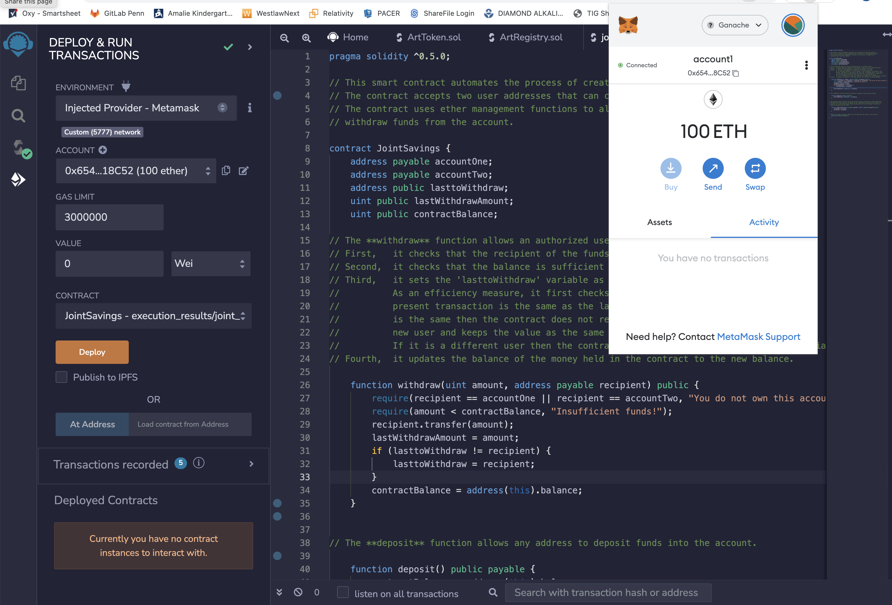

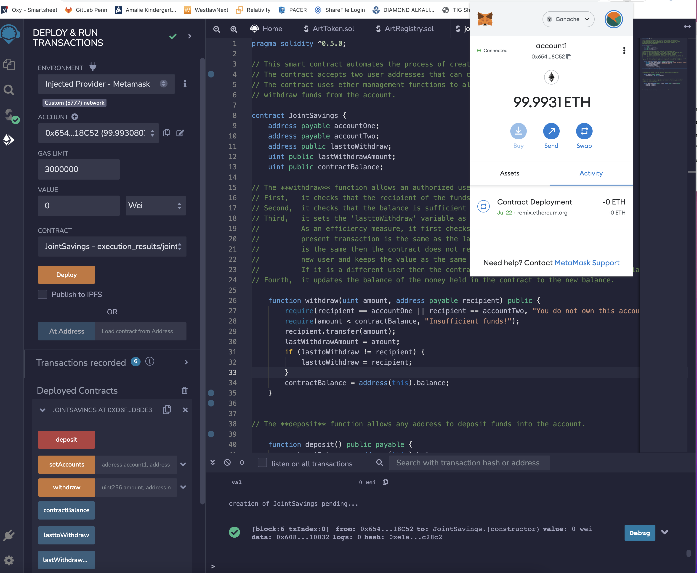
___

### 2. Set the accounts. At this time the balance of the contract (savings account) is showing as zero.

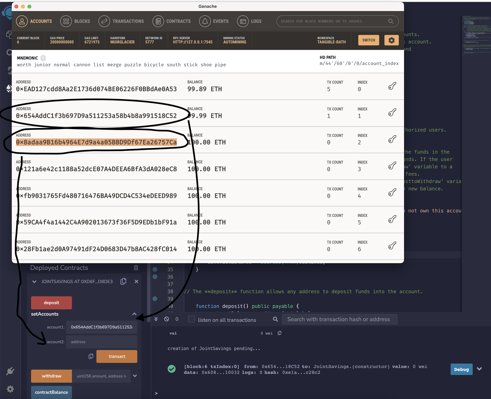

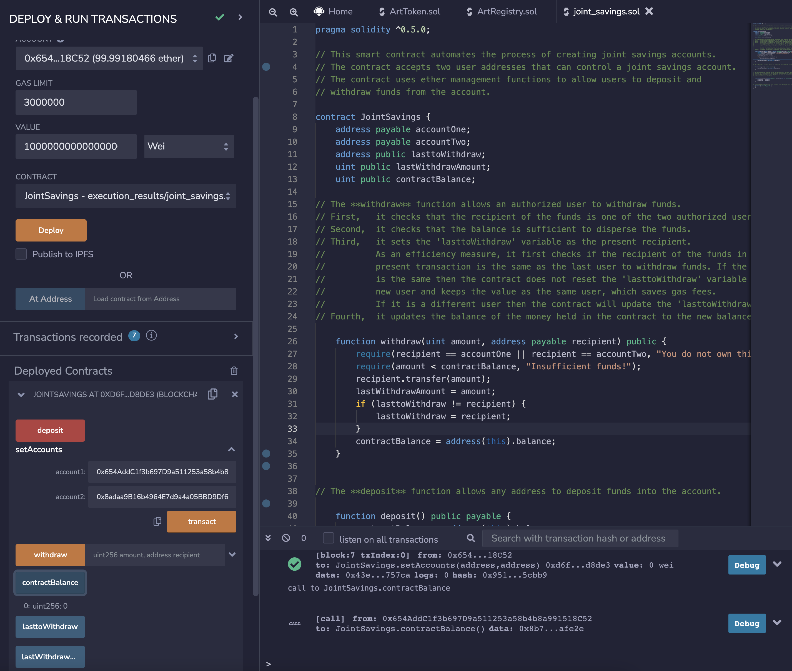

___

### 3. Deposit 1 eth into the savings account smart contract, using the wei denomination.

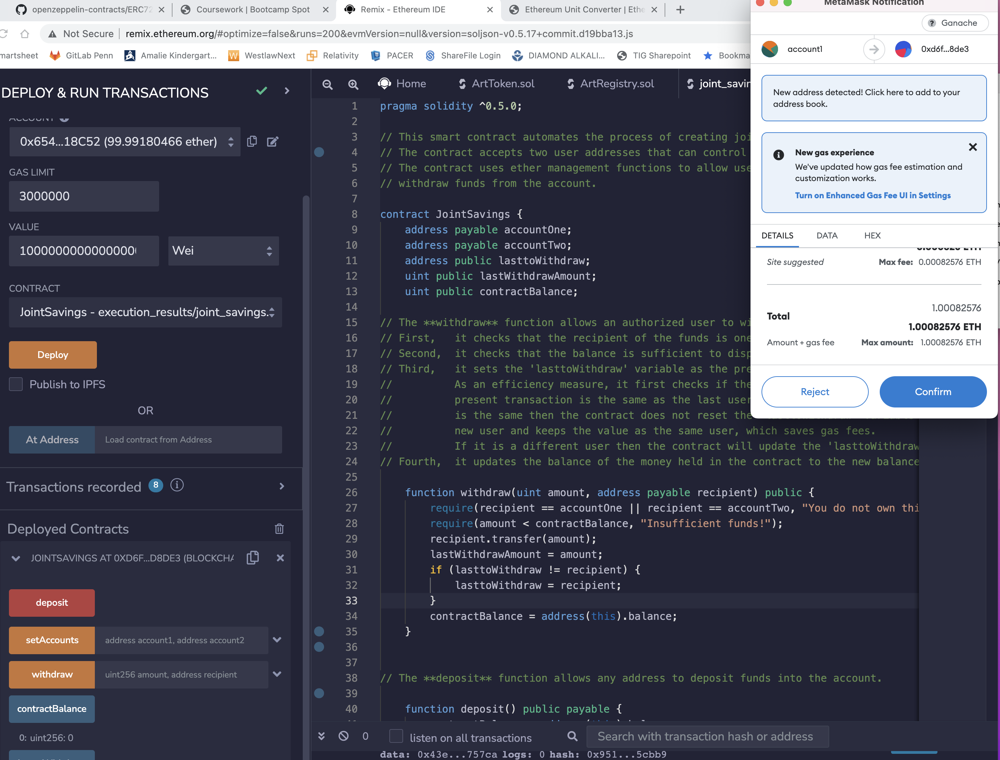

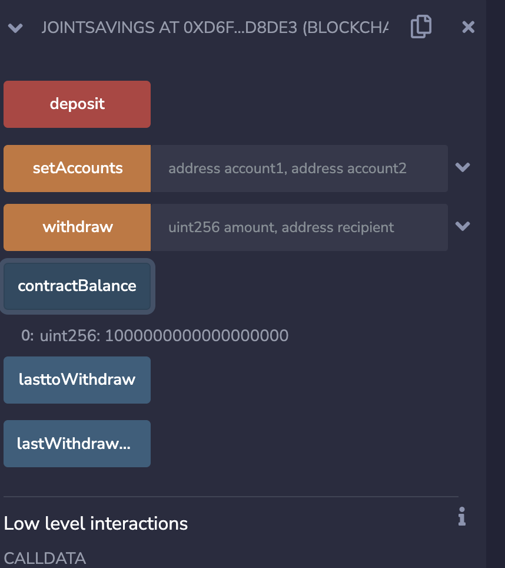
____

### 4. Deposit 10 eth into the savings account.

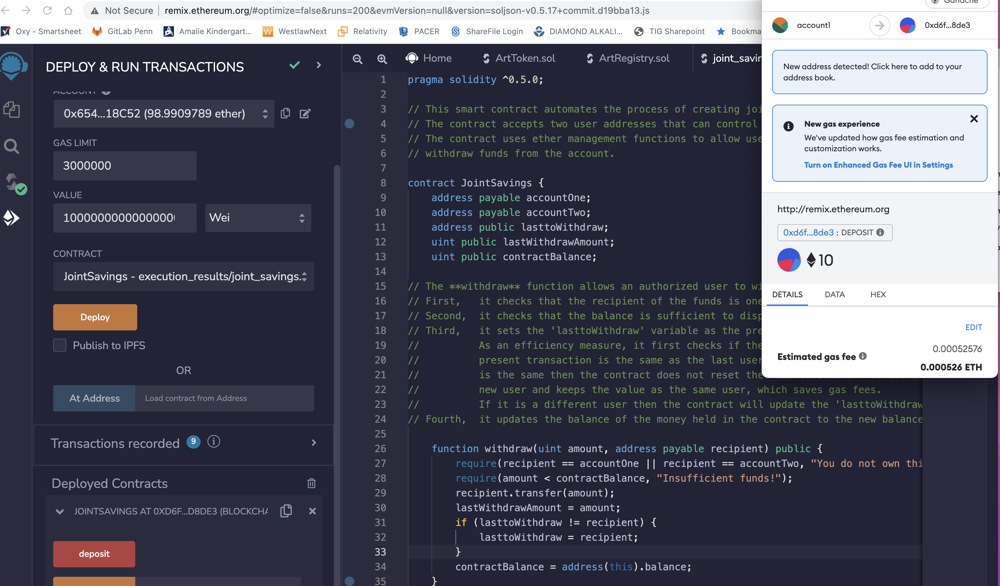

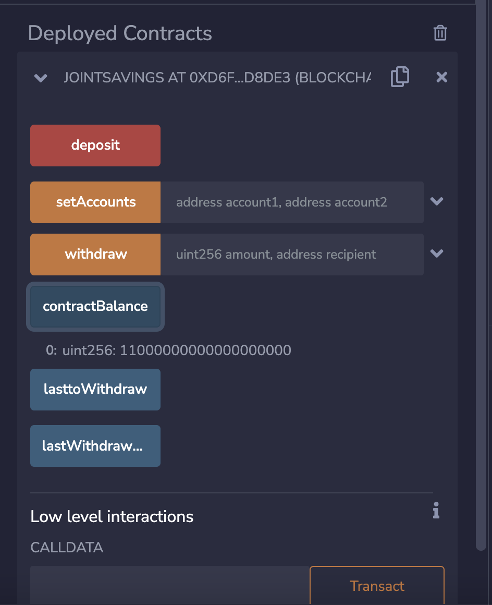
___

### 5. Deposit 5 eth into the savings account.

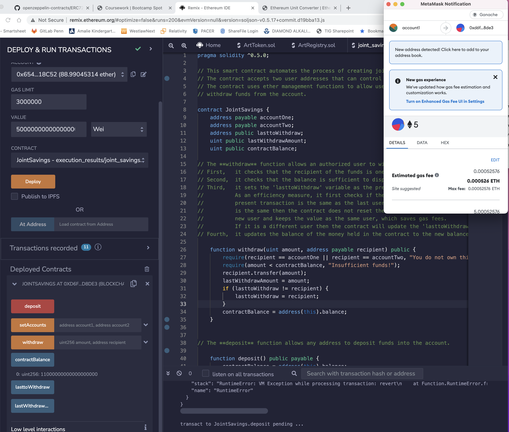

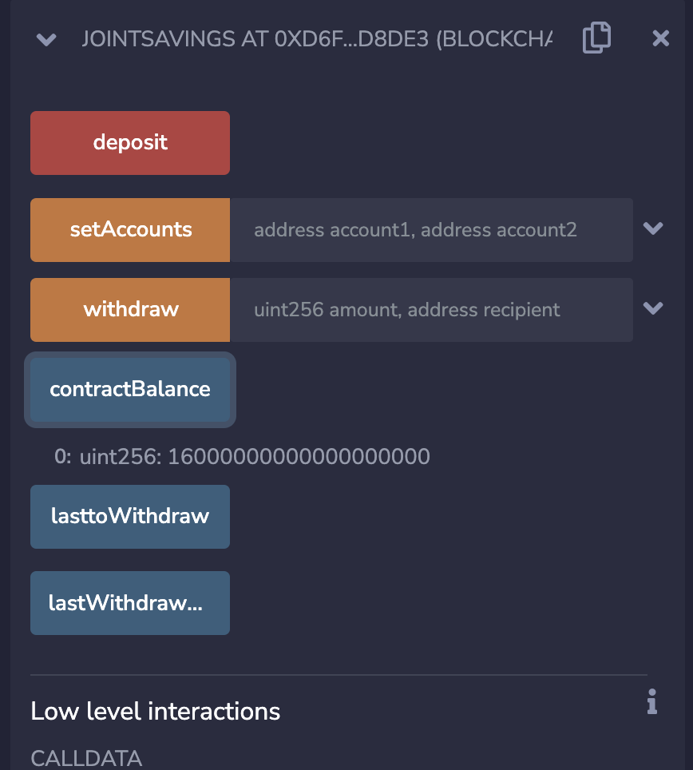
___

### 6. Withdraw 5 eth into Account One.

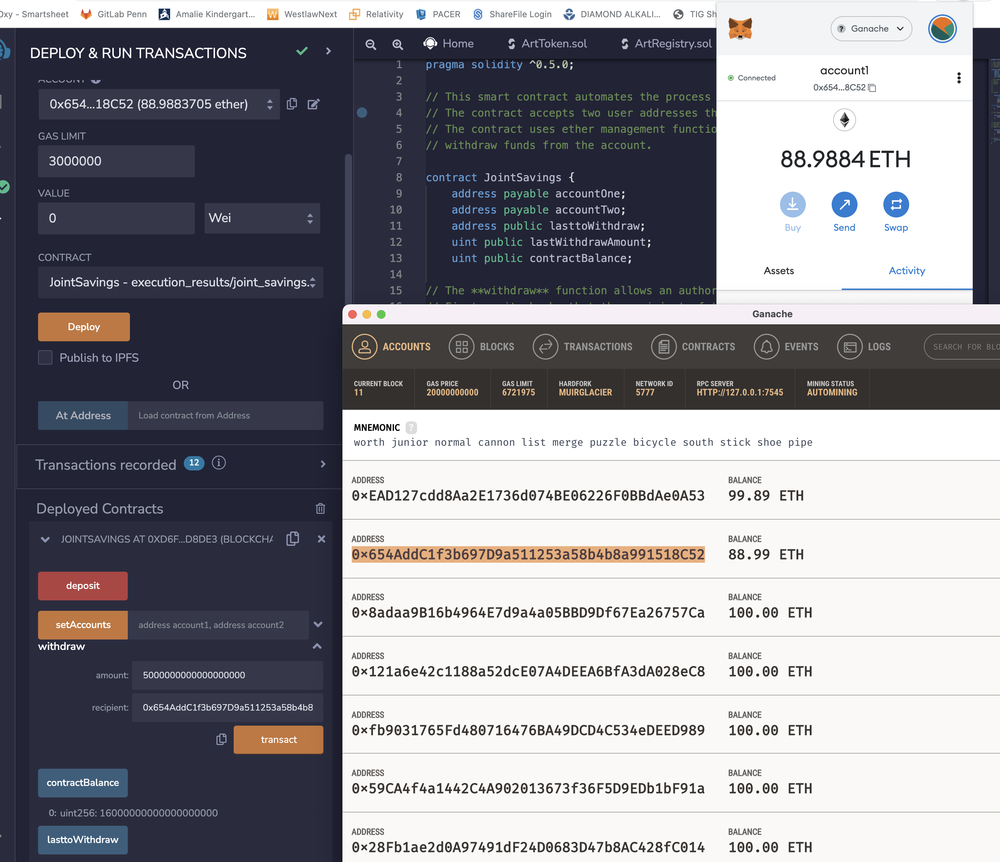

___

### 7. Withdraw 10 eth into Account Two. Note the "lasttoWithdraw" variable is set as the Account Two address.

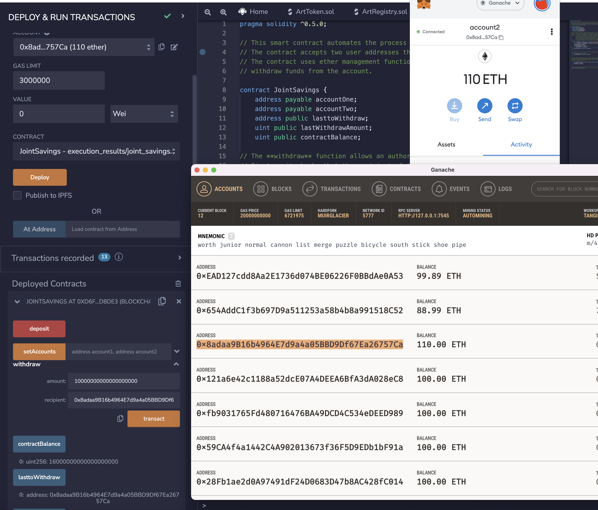
___

### 8. Check the final balance of the savings account contract. After adding 16 eth, then withdrawing 5 eth to Account One and 10 eth to Account Two the balance of the savings account stands at 1 eth (1000000000000000000 wei).

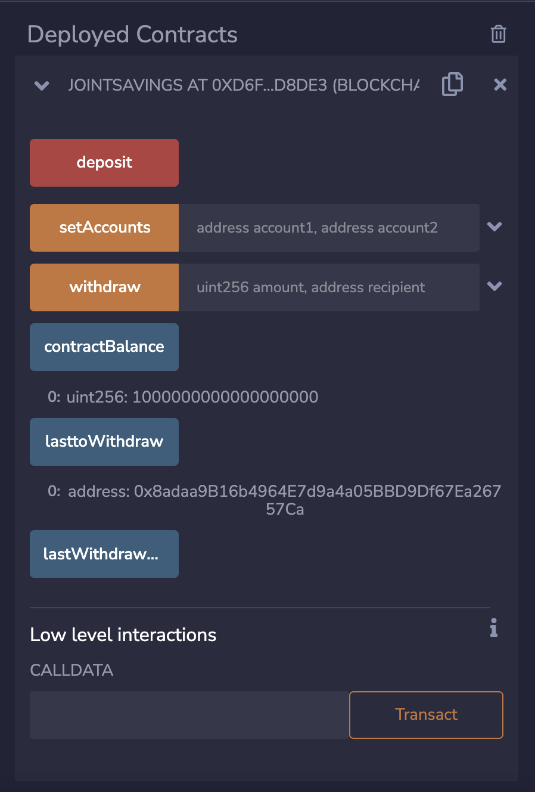